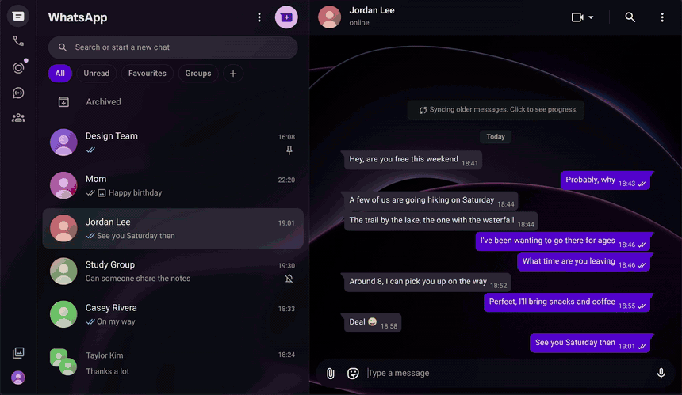
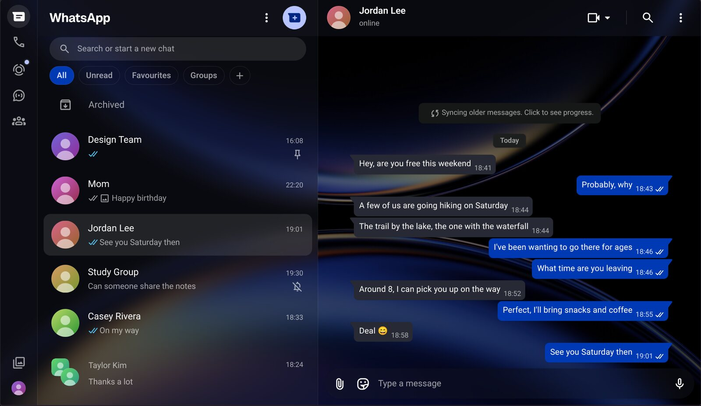
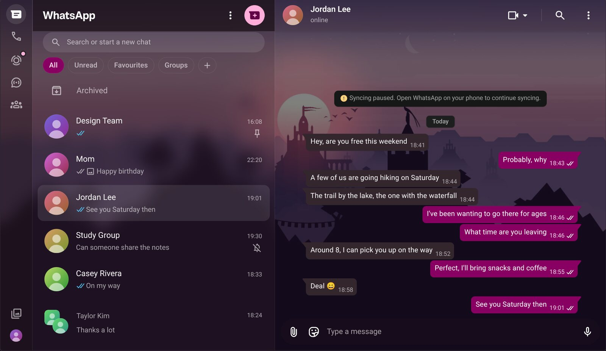
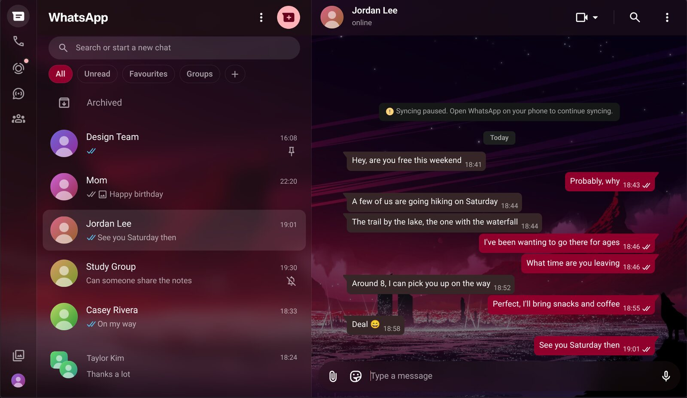
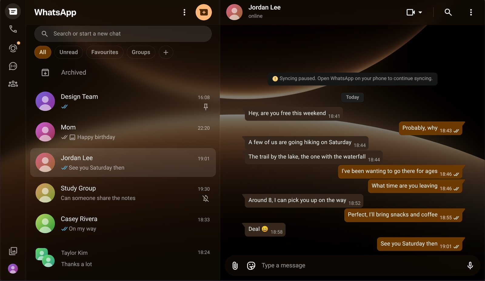
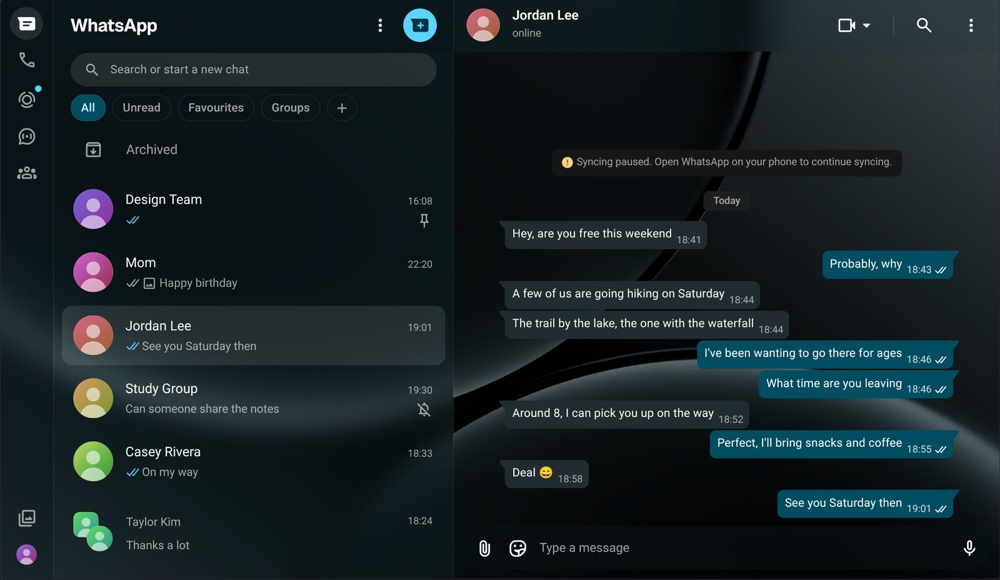
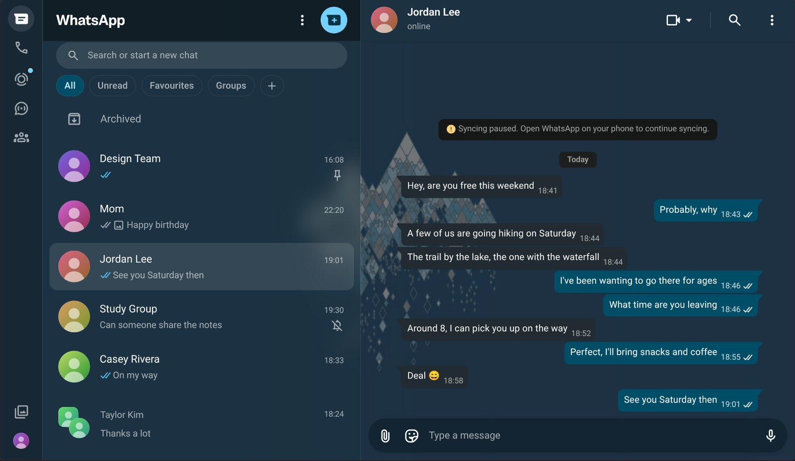

<div align="center">


# WhatsApp Matugen Theme

**Make WhatsApp Web match your wallpaper.**<br>
Your wallpaper becomes the chat background, the sidebar turns to frosted glass,<br>
and every color follows your desktop when you change wallpapers.

<br>



</div>

<br>

## What it does

- 🖼️ **Your wallpaper, everywhere.** The chat background is any image you choose (or your desktop wallpaper on Linux), sharp in the chat and blurred behind the sidebar, like one picture across the window.
- 🧊 **Frosted glass.** The sidebar, the top bar, the typing box and the side panels are see-through and blurred.
- 🎨 **Colors that match.** Message bubbles, buttons, links, the little status dots and even the tab icon take the colors of your wallpaper.
- ⚡ **No setup.** Install the extension, drop in an image, done. Works on Windows, macOS and Linux.
- 🔄 **Follows your desktop (optional, Linux).** With the small helper, WhatsApp updates by itself within about 30 seconds whenever you change your desktop wallpaper.
- 🔒 **Private.** Everything stays on your computer. Nothing is sent anywhere, and your messages are never read.

## Looks like this

One extension, seven different wallpapers:

<table>
  <tr>
    <td></td>
    <td></td>
  </tr>
  <tr>
    <td align="center">Blue</td>
    <td align="center">Pink</td>
  </tr>
  <tr>
    <td></td>
    <td></td>
  </tr>
  <tr>
    <td align="center">Red</td>
    <td align="center">Orange</td>
  </tr>
  <tr>
    <td></td>
    <td></td>
  </tr>
  <tr>
    <td align="center">Cyan</td>
    <td align="center">Sky</td>
  </tr>
</table>

<sub>The chats in these pictures are made up.</sub>

## Install

It works in any **Chromium browser** (Chrome, Edge, Brave, Opera, Vivaldi, Helium…) on **Windows, macOS and Linux**.

### Step 1: get the extension

**[Download the extension (zip)](https://github.com/SammyNashed/whatsapp-matugen-theme/releases/latest/download/whatsapp-matugen-theme-extension.zip)** and unzip it anywhere you'll keep it (don't delete the folder afterwards).

### Step 2: add it to your browser

Browsers don't let websites install extensions without a store, so this takes four clicks:

1. Go to **`chrome://extensions`** (Edge: `edge://extensions`, Brave: `brave://extensions`, Opera: `opera://extensions`).
2. Turn on **Developer mode** (switch in the top right corner).
3. Click **Load unpacked** and pick the unzipped folder.
4. The wallpaper picker opens by itself. If it doesn't, click the extension icon, then **Choose wallpaper**.

### Step 3: pick a wallpaper

Drop in **any image** or pick one of the ready-made styles, check the preview, and press **Use this wallpaper**. Then open **[web.whatsapp.com](https://web.whatsapp.com)**. Colors are taken from your image. If it has several strong colors, you can choose which one to use.

You can come back any time: click the extension icon → **Choose wallpaper**.

<details>
<summary><b>Optional: follow your desktop wallpaper automatically (Linux)</b></summary>
<br>

If you use **Hyprland** with **[matugen](https://github.com/InioX/matugen)** and **[awww](https://codeberg.org/LGFae/awww)**, a tiny helper can make WhatsApp follow your desktop wallpaper by itself, updating within about 30 seconds whenever you change it:

```sh
curl -fsSL https://raw.githubusercontent.com/SammyNashed/whatsapp-matugen-theme/main/install.sh | bash
```

The installer checks your setup, installs the helper to run in the background, and tells you what to do next. After that, open the picker page and choose **Follow my desktop wallpaper**. To remove the helper later: `bash ~/.local/share/whatsapp-matugen-theme/uninstall.sh`.

</details>

## Using it

**Is it working?** Click the extension icon and press **Check now**. It tells you if everything is in place. If WhatsApp ever changes its website in a way the theme doesn't expect, a small red **!** appears on the icon and says which part needs an update. Your chats keep working either way.

**Want the glass more or less see-through?** Open `content.js` in the extension folder, change `GLASS_ALPHA` near the top (lower = clearer, higher = more solid), then click the reload arrow on the extension in `chrome://extensions`.

## Uninstall

Click **Remove** on the extension in `chrome://extensions`. If you installed the optional helper, run its uninstall command first (see above).

## Questions

<details>
<summary><b>Does it read my messages?</b></summary>

No. It only changes how WhatsApp looks. It doesn't read, store or send any of your chats, and it doesn't talk to any server on the internet. The image you choose stays in your browser.
</details>

<details>
<summary><b>What is the optional "helper"?</b></summary>

A web page can't see your desktop, so on Linux a small program on your computer can tell the extension which wallpaper and colors you're using. It only answers your own computer (address `127.0.0.1`, port `8765`) and uses almost no resources. You don't need it unless you want automatic following.
</details>

<details>
<summary><b>WhatsApp looks normal again. What happened?</b></summary>

Open the picker (extension icon → **Choose wallpaper**) and check a wallpaper is selected, then reload WhatsApp. If you use the helper, run `systemctl --user restart whatsapp-theme-helper`. If the red **!** shows on the extension icon, WhatsApp changed something; please open an issue and mention what the popup says.
</details>

<details>
<summary><b>Does it work on Firefox or Safari?</b></summary>

Not yet. It needs a Chromium-based browser for now.
</details>

---

<div align="center">
<sub>Not affiliated with WhatsApp or Meta. Released under the MIT license.</sub>
</div>
